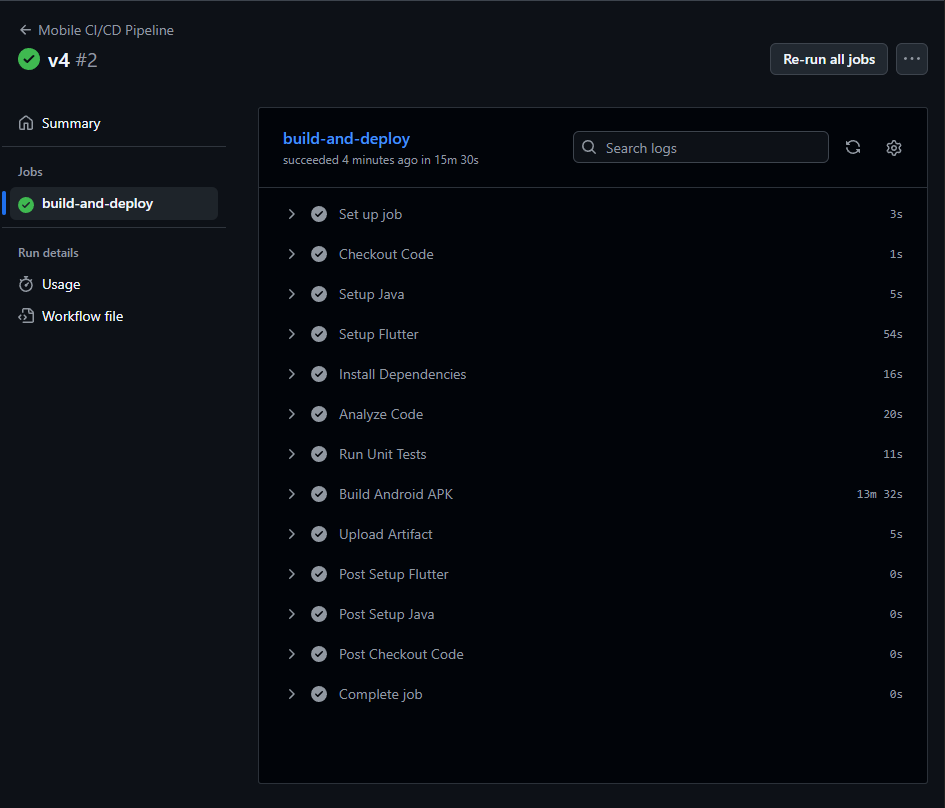
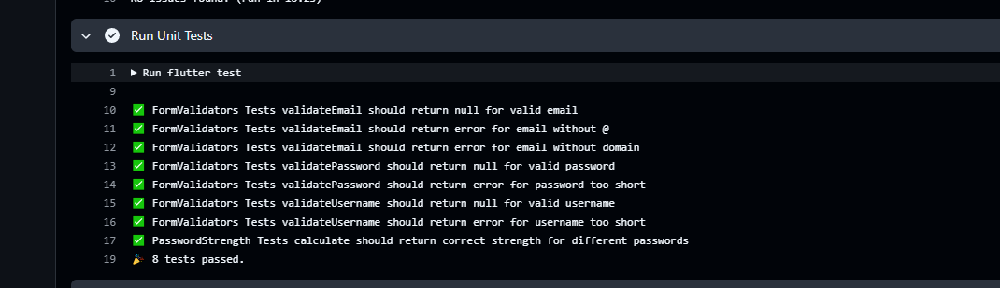
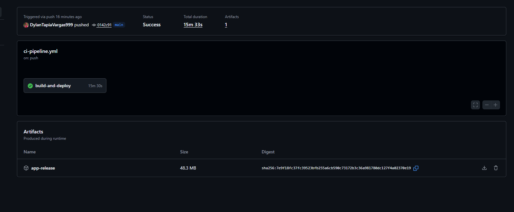

# SM2_Examen_CICD

[](https://github.com/DylanTapiaVargas999/SM2_Examen_CICD/actions/workflows/ci-pipeline.yml)

## 📊 Datos del Alumno

- **Nombre:** Dylan Yariet Tapia Vargas
- **Tecnología:** Proyecto en Flutter
- **Versión Flutter:** 3.32.5
- **Fecha:** Noviembre 2025

## 🔗 Enlace al Repositorio

**GitHub Repository:** https://github.com/DylanTapiaVargas999/SM2_Examen_CICD

## ✅ Badge de Estado

El badge superior muestra el estado actual del pipeline CI/CD. Debe aparecer en **verde (Passing)** cuando todas las pruebas y la construcción sean exitosas.



## 🧪 Evidencia de Tests

### Pruebas Unitarias Implementadas

El proyecto incluye **8 pruebas unitarias** en el archivo `test/validator_test.dart` que cubren:

1. ✅ Validación de email válido
2. ✅ Validación de email inválido sin @
3. ✅ Validación de email inválido sin dominio
4. ✅ Validación de contraseña válida
5. ✅ Validación de contraseña muy corta
6. ✅ Validación de nombre de usuario válido
7. ✅ Validación de nombre de usuario muy corto
8. ✅ Cálculo de fuerza de contraseña

### Captura de Pantalla - Tests Exitosos

 
```
Resultado esperado:
✅ 00:0X +8: All tests passed!
```

## 🏗️ Evidencia de Construcción

### Pipeline CI/CD

El pipeline incluye los siguientes pasos:


1. **Checkout Code** - Descarga el código
2. **Setup Java** - Configura Java 17 para Android
3. **Setup Flutter** - Configura Flutter 3.32.5
4. **Install Dependencies** - Instala dependencias
5. **Analyze Code** - Análisis de código
6. **Run Unit Tests** - Ejecuta pruebas unitarias
7. **Build Android APK** - Construye APK de Android
8. **Upload Artifact** - Sube el artefacto APK

### Captura de Pantalla - Artefactos



**Artefacto generado:**
- 📱 `app-release.apk` - Aplicación Android lista para instalación

**Link de Artefacto Generado:**
https://github.com/DylanTapiaVargas999/SM2_Examen_CICD/actions/runs/19683617332


## 🚀 Instrucciones de Uso

### Ejecutar Tests Localmente
```bash
flutter test
```

### Construir APK
```bash
flutter build apk --release
```

### Análisis de Código
```bash
flutter analyze
```

## 📁 Estructura del Proyecto

```
lib/
├── core/
│   └── utils/
│       ├── form_validators.dart    # Validadores principales
│       └── simple_validators.dart  # Validadores simples
└── ...

test/
└── validator_test.dart            # Pruebas unitarias
```

## 🛠️ Tecnologías Utilizadas

- **Flutter** 3.32.5
- **Dart** SDK
- **GitHub Actions** para CI/CD
- **Flutter Test** para pruebas unitarias
- **Android** como plataforma objetivo